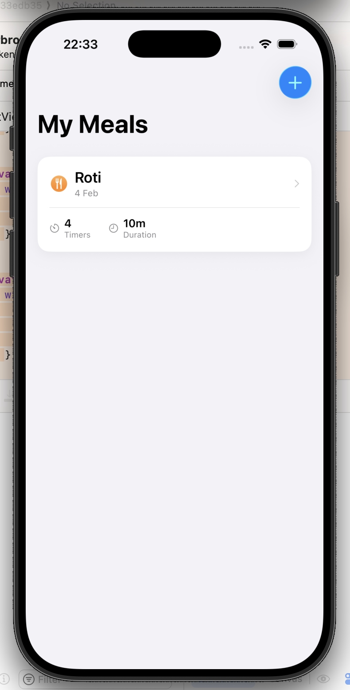
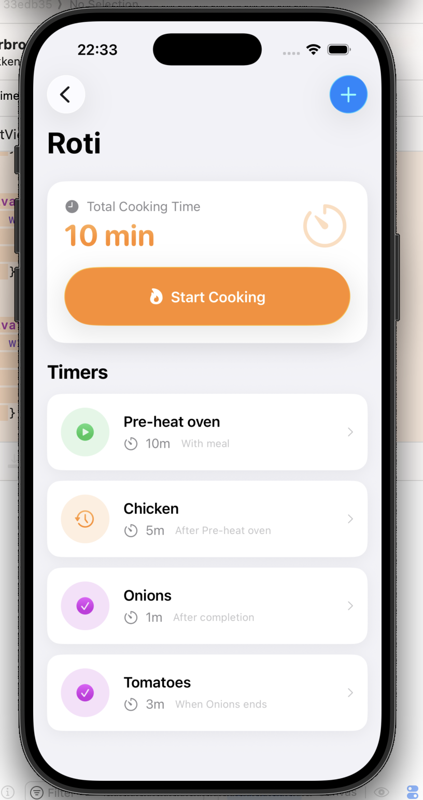
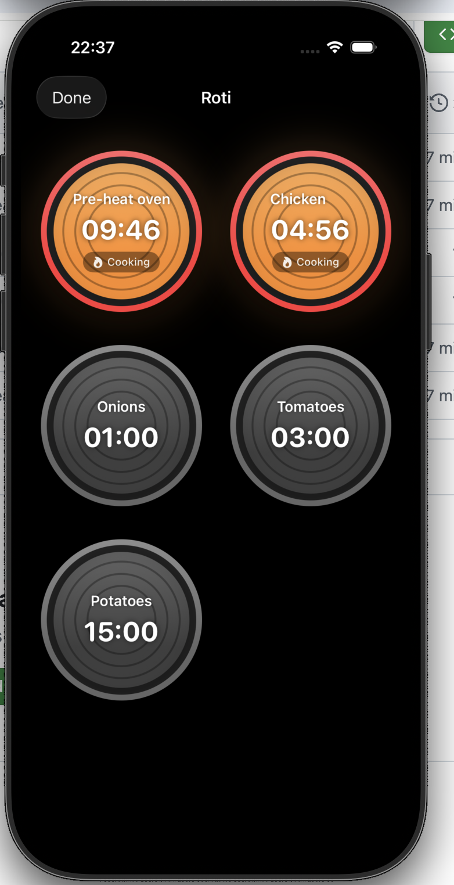
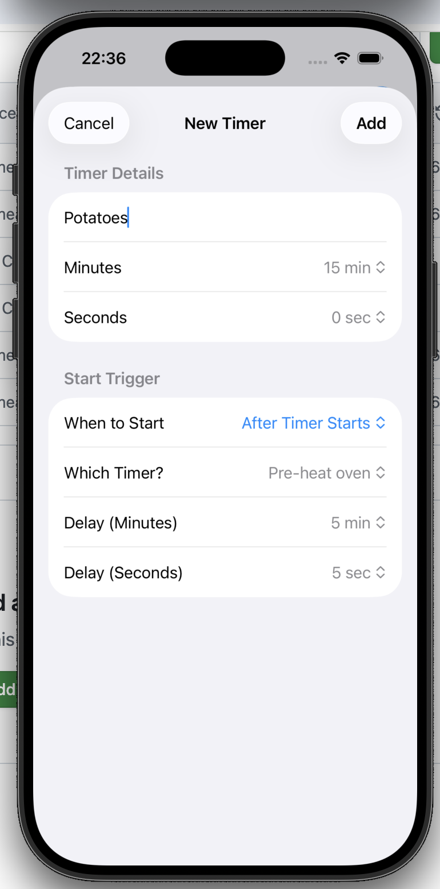
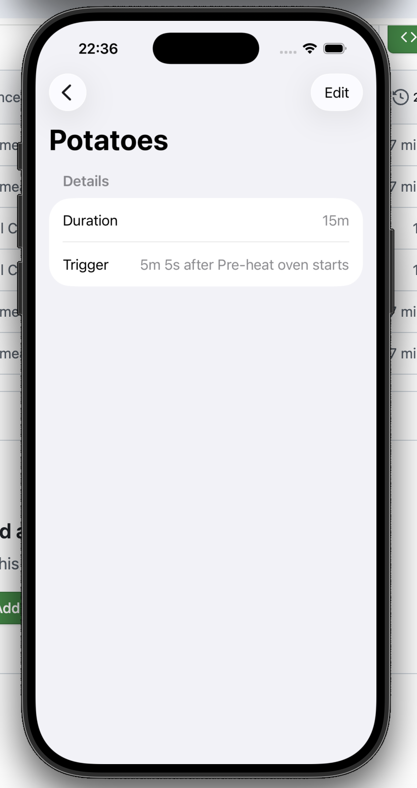
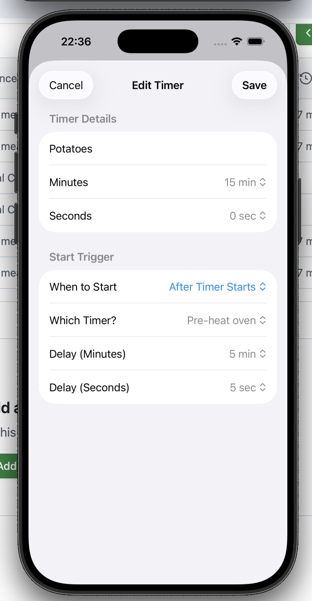
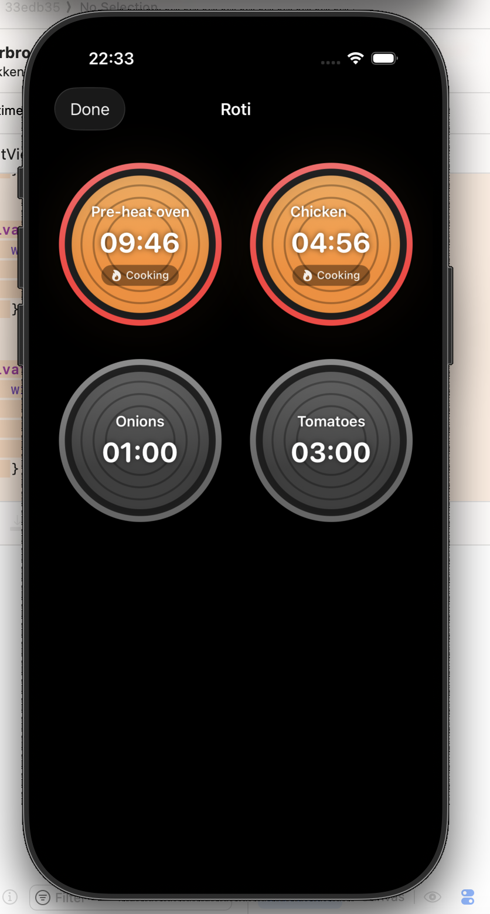

# Cooking Timer

A beautiful iOS cooking timer app that helps you coordinate multiple dishes for perfect meal timing. Built with SwiftUI and featuring Apple's Liquid Glass design system.

<div align="center">
  
  
  
</div>

## ✨ Features

### 🍳 Smart Timer Sequencing
- Create meals with multiple timers for different dishes
- Set up complex timer dependencies:
  - **Manual**: Start timers manually when you're ready
  - **With Meal**: Start automatically when you begin cooking
  - **After Timer Starts**: Begin X seconds/minutes after another timer starts
  - **When Timer Completes**: Start automatically when another timer finishes

### 🔥 Stove Burner Visualization
- Realistic stove burner interface with glowing effects
- Color-coded status indicators:
  - Dark gray: Waiting to start
  - Orange/Red: Actively cooking
  - Yellow: Paused
  - Green: Completed
- Animated pulsing glow for running timers

### 💎 Modern Design
- Built with Apple's **Liquid Glass** design system
- Beautiful card-based layouts
- Smooth animations and transitions
- Native iOS design patterns
- Dark mode support

### 📱 User Experience
- Intuitive meal creation and editing
- Visual timeline showing total cooking time
- Easy timer management with drag-to-reorder
- Haptic feedback on timer completion
- Persistent storage with SwiftData + CloudKit sync

## 📸 Screenshots

### Meal Management
<div align="center">
  
  
</div>

### Timer Configuration
<div align="center">
  
  
  
</div>

### Active Cooking
<div align="center">
  
  
</div>

## 🛠 Technical Details

### Built With
- **SwiftUI**: Modern declarative UI framework
- **SwiftData**: Apple's latest data persistence framework
- **CloudKit**: Automatic cloud sync across devices
- **Liquid Glass**: Apple's newest design system
- **Combine**: Reactive timer management

### Requirements
- iOS 18.0+
- Xcode 16.0+
- Swift 6.0+

### Architecture
- **MVVM pattern** with SwiftUI
- **SwiftData models** with enum support via raw value storage
- **ID-based relationships** for robust timer dependencies
- **Observable pattern** for reactive state management
- **Automatic schema migration** during development

### Key Implementations
- Custom `@Model` classes with computed properties for enums
- UUID-based timer relationships to avoid SwiftData conflicts
- Real-time timer coordination with `DispatchQueue` scheduling
- Liquid Glass effects using `.glassProminent` and `.glass` button styles
- Custom burner views with animated glow effects

## 🚀 Getting Started

1. Clone the repository
```bash
git clone https://github.com/yourusername/cooking-timer.git
```

2. Open in Xcode
```bash
cd cooking-timer
open "Cooking Timer.xcodeproj"
```

3. Build and run on your device or simulator

## 💡 Usage Examples

### Simple Meal
Perfect for straightforward cooking:
- **Pasta**: 12 minutes (Start with meal)
- **Sauce**: 8 minutes (Start with meal)

### Complex Meal with Sequencing
For advanced coordination:
- **Pre-heat oven**: 10 minutes (Start with meal)
- **Chicken**: 45 minutes (Start when oven pre-heat completes)
- **Vegetables**: 20 minutes (Start 25 minutes after chicken starts)
- **Bread**: 5 minutes (Start 40 minutes after chicken starts)

Everything finishes at the same time!

## 🎨 Design Philosophy

This app embraces Apple's design principles:
- **Clarity**: Clean, focused interface with clear visual hierarchy
- **Deference**: Content-first design with beautiful but unobtrusive UI
- **Depth**: Layers, shadows, and depth create realistic connections

The stove burner metaphor provides an intuitive, skeuomorphic interface that makes timer status immediately apparent.

## 🔮 Future Enhancements

- [ ] Apple Watch companion app
- [ ] Widget support for home screen
- [ ] Recipe integration
- [ ] Voice timer control with Siri
- [ ] Timer templates for common dishes
- [ ] Notifications for timer completion
- [ ] Share meals with family/friends

## 🤝 Contributing

Contributions are welcome! Please feel free to submit a Pull Request.

## 📄 License

This project is licensed under the MIT License - see the LICENSE file for details.

## 🙏 Acknowledgments

- Built with assistance from Claude (Anthropic)
- Inspired by real-world cooking coordination challenges
- Uses Apple's Liquid Glass design system
- SwiftUI sample code patterns from Apple's Landmarks app

---

**Built with ❤️ by Tom Verbroekken**
